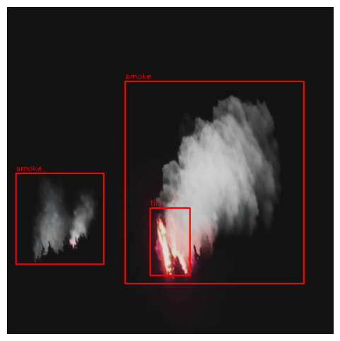

<div align="center">

</div>

<p align="center">
<em>Caption: Example of fire and smoke detection with bounding boxes</em>
</p>


A real-time forest fire detection system using YOLO-based models and IoT camera feeds.

## Features
- Real-time fire and smoke detection using YOLOv8 models

- Live IoT camera feed integration

- Video processing capabilities with frame-by-frame analysis

- Custom image filters for noise reduction in natural environments

- Automatic saving of detected frames with bounding box annotations

- Configurable confidence thresholds for detection sensitivity

- Comprehensive dataset collection and annotation pipeline

- Model training with optimization techniques

## Installation

```bash
pip install -r requirements.txt
```

## Usage

````bash 
python fire_detection.py

````
## Project Structure

- fire_detection.py - Main detection script

- models/ - Trained YOLO model

- samples/ - Test video files

- results/ - Output directory for detected images